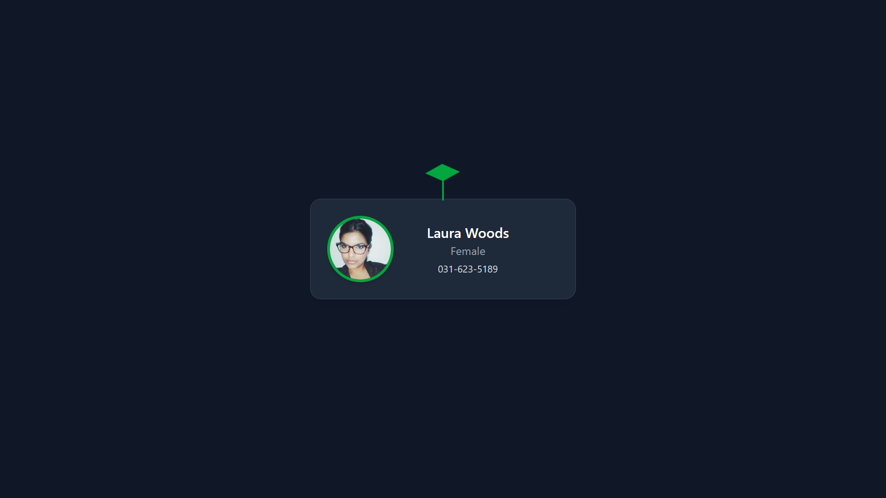

# Webtree Global - User Profile Card

A stylish and animated user profile card component built with React, Tailwind CSS, and Vite. Fetches random user data from the [Random User API](https://randomuser.me/) and displays it in an elegant card design with interactive elements.



## Features

- 🌟 Dynamic user data fetching from API
- 🌀 Animated loading spinner
- 🌿 Interactive SVG plant animation
- 🖼️ Profile image hover effect
- 📱 Responsive design
- 📞 Displays user information including:
  - Full name
  - Gender
  - Phone number
  - Large profile image

## Technologies Used

- React 19
- Tailwind CSS
- Vite
- Random User API

## Installation

1. Clone the repository:
```bash
git clone https://github.com/your-username/webtree-global.git
